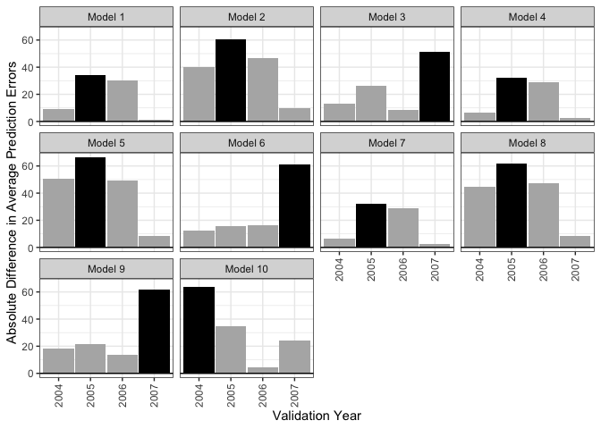
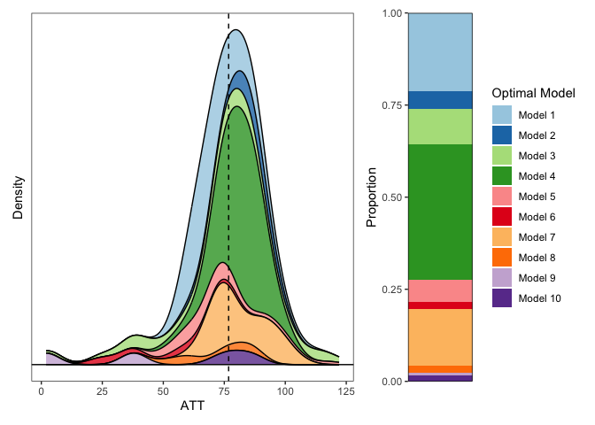

<!-- README.md is generated from README.Rmd. Please edit that file -->

# eepd

<!-- badges: start -->
<!-- badges: end -->

``` r
library(eepd)
data("ptpdata")
```

## Supplying models

We can specify the models to test using `eepd_mod()`. This create a full
cross of all supplied arguments, which include model formula, families,
whether the outcome is logged or not, whether fixed effects are included
or not, whether the outcome should be a difference, and whether outcome
lags shoudl appear as predictors. Below, we create a cross of 9 models.

``` r
models <- eepd_mod(list(deaths ~ 1,
                        deaths ~ 1 + year,
                        deaths ~ 1 + poly(year, 2)),
                   family = list("gaussian", "quasipoisson"),
                   log = c(TRUE, FALSE),
                   lag = 0, diff_k = 0, fixef = TRUE)

models
#> - Model 1:
#> deaths ~ 1
#> family: gaussian(link = 'identity')
#> outcome lag: none
#> outcome diff: none
#> log outcome: yes
#> unit fixed effects: yes
#> 
#> - Model 2:
#> deaths ~ 1 + year
#> family: gaussian(link = 'identity')
#> outcome lag: none
#> outcome diff: none
#> log outcome: yes
#> unit fixed effects: yes
#> 
#> - Model 3:
#> deaths ~ 1 + poly(year, 2)
#> family: gaussian(link = 'identity')
#> outcome lag: none
#> outcome diff: none
#> log outcome: yes
#> unit fixed effects: yes
#> 
#> - Model 4:
#> deaths ~ 1
#> family: gaussian(link = 'identity')
#> outcome lag: none
#> outcome diff: none
#> log outcome: no
#> unit fixed effects: yes
#> 
#> - Model 5:
#> deaths ~ 1 + year
#> family: gaussian(link = 'identity')
#> outcome lag: none
#> outcome diff: none
#> log outcome: no
#> unit fixed effects: yes
#> 
#> - Model 6:
#> deaths ~ 1 + poly(year, 2)
#> family: gaussian(link = 'identity')
#> outcome lag: none
#> outcome diff: none
#> log outcome: no
#> unit fixed effects: yes
#> 
#> - Model 7:
#> deaths ~ 1
#> family: quasipoisson(link = 'log')
#> outcome lag: none
#> outcome diff: none
#> log outcome: no
#> unit fixed effects: yes
#> 
#> - Model 8:
#> deaths ~ 1 + year
#> family: quasipoisson(link = 'log')
#> outcome lag: none
#> outcome diff: none
#> log outcome: no
#> unit fixed effects: yes
#> 
#> - Model 9:
#> deaths ~ 1 + poly(year, 2)
#> family: quasipoisson(link = 'log')
#> outcome lag: none
#> outcome diff: none
#> log outcome: no
#> unit fixed effects: yes
```

Normally, this cross would yield 12 = 3 (formulas) x 2 (families) x 2
(log T/F), but by default any models with non-linear links and
`log = TRUE` are removed, leaving 9 models. If we want to manually add
other models, we can so by creating a new models object and appending it
to the current one.

``` r
models2 <- eepd_mod(list(deaths ~ 1),
                    diff_k = 1)

models <- c(models, models2)

models
#> - Model 1:
#> deaths ~ 1
#> family: gaussian(link = 'identity')
#> outcome lag: none
#> outcome diff: none
#> log outcome: yes
#> unit fixed effects: yes
#> 
#> - Model 2:
#> deaths ~ 1 + year
#> family: gaussian(link = 'identity')
#> outcome lag: none
#> outcome diff: none
#> log outcome: yes
#> unit fixed effects: yes
#> 
#> - Model 3:
#> deaths ~ 1 + poly(year, 2)
#> family: gaussian(link = 'identity')
#> outcome lag: none
#> outcome diff: none
#> log outcome: yes
#> unit fixed effects: yes
#> 
#> - Model 4:
#> deaths ~ 1
#> family: gaussian(link = 'identity')
#> outcome lag: none
#> outcome diff: none
#> log outcome: no
#> unit fixed effects: yes
#> 
#> - Model 5:
#> deaths ~ 1 + year
#> family: gaussian(link = 'identity')
#> outcome lag: none
#> outcome diff: none
#> log outcome: no
#> unit fixed effects: yes
#> 
#> - Model 6:
#> deaths ~ 1 + poly(year, 2)
#> family: gaussian(link = 'identity')
#> outcome lag: none
#> outcome diff: none
#> log outcome: no
#> unit fixed effects: yes
#> 
#> - Model 7:
#> deaths ~ 1
#> family: quasipoisson(link = 'log')
#> outcome lag: none
#> outcome diff: none
#> log outcome: no
#> unit fixed effects: yes
#> 
#> - Model 8:
#> deaths ~ 1 + year
#> family: quasipoisson(link = 'log')
#> outcome lag: none
#> outcome diff: none
#> log outcome: no
#> unit fixed effects: yes
#> 
#> - Model 9:
#> deaths ~ 1 + poly(year, 2)
#> family: quasipoisson(link = 'log')
#> outcome lag: none
#> outcome diff: none
#> log outcome: no
#> unit fixed effects: yes
#> 
#> - Model 10:
#> deaths ~ 1
#> family: gaussian(link = 'identity')
#> outcome lag: none
#> outcome diff: 1
#> log outcome: no
#> unit fixed effects: no
```

This leaves us with 10 models.

## Fitting the models

Next we fit all 10 models to the data. We do so once for each validation
time to compute the average prediction error that will be used to select
the optimal model later. We also do so for the final evlauation time to
compute the ATT. All models are fit simultaneously so the simulation can
use the full joint distribution of model parameter estimates. For each
validation time, each model is fit using a dataset that contains data
points prior to that time. In a later step, the average absolute
prediction error will be computed at the corresponding validation time.

We use `eepd_fit()` to fit the models.

``` r
fits <- eepd_fit(models, data = ptpdata,
                 group_var = "group",
                 time_var = "year",
                 val_times = 2004:2007,
                 post_time = 2008,
                 unit_var = "state")
```

NOTE: add a print method

## Selecting the optimal model and computing the ATT

We select the optimal model by computing the average absolute
predictions errors for each model and validation time and choose choose
the optimal model as that which has lowest maximum average absolute
preidciton error across validation times. Then, we compute the ATT from
this model.

`eepd_sim()` does this when the `nsim` argument is set to 0 (which it is
by default). In this case, no simulation is done and the model selection
is treated as fixed. We do not get a distribution of ATTs, just a single
ATT chosen as that computed from the optimal model.

``` r
est <- eepd_sim(fits)

plot(est)
```



``` r

est
#> Estimation results:
#> - ATT: 83.58929
#> - Optimal model: Model 4
```

## Simulating Model Selection

Given that the resulting ATT does not account for variability in model
selection, we can also simulate model selection by drawing coefficients
from the joint posterior of all fitted models and performing model
selection and calculating the ATT in each simulation. We can do this
simply by supplying an argument to `nsim` indicating the number of
simulations. More is better but takes longer. We can supply an argument
to `cl` to engage parallelization and set `verbose = TRUE` to request a
progress bar.

``` r
est_sim <- eepd_sim(fits, nsim = 300, cl = 4)

est_sim
#> Simulation results:
#> - ATT: 76.77524
#> - Optimal models:
#> opt_mods
#>  Model 1  Model 2  Model 3  Model 4  Model 5  Model 6  Model 7  Model 8 
#>       64       14       29      110       18        6       46        6 
#>  Model 9 Model 10 
#>        2        5

plot(est_sim, palette = "Paired")
```



Printing the output produces the estimate of the ATT computed using the
optimal model in each simulation averaged across all simulations. The
plot displays a density of the estimates colored by model and the
distribution of which models were most frequently determined to be
optimal.

## Bootstrapping the whole thing

We can bootstrap the whole thing using `eepd_boot()`. By default, this
uses the fractional weighted bootstrap as implement in `fwb::fwb()` to
draw bootstrap samples and perform model fitting, simulation, model
selection, and computation of the ATT, yielding a distribution of ATTs
from which one can perform inference.

`eepd_boot()` takes in the same arguments as `eepd_fit()` as well as
`nboot` for the number of bootstrap replications and `nsim` for the
number of simulation to do within each each bootstrap sample.

``` r
boot_fits <- eepd_boot(models, data = ptpdata,
                       nboot = 199, nsim = 50,
                       group_var = "group",
                       time_var = "year",
                       val_times = 2004:2007,
                       post_time = 2008,
                       unit_var = "state",
                       cl = 4, verbose = T)

summary(boot_fits, ci.type = "perc")
#>     Estimate Std. Error CI 2.5 % CI 97.5 %
#> ATT    83.59       7.96    52.57     82.41
```

The output is a `fwb_boot` object that can be examined using tools from
`fwb`, such as `summary()`, which produces the point estimate (computed
on the original dataset) and confidence interval.
